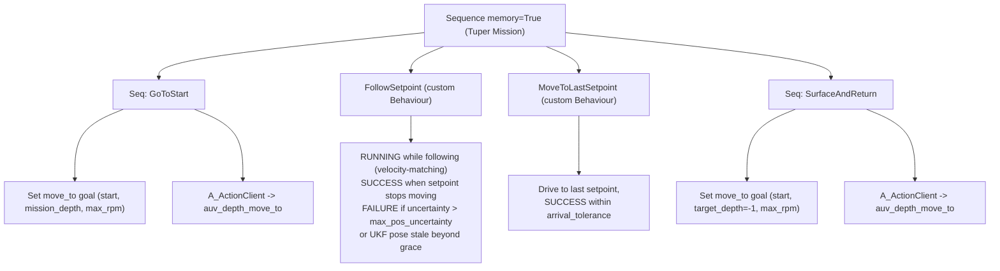

# lolo_tuper

LoLo's **TUPER** behaviour: an action server whose execution *is* a behaviour
tree. LoLo dives to a mission depth, follows an acoustically-estimated setpoint
that tracks a pair of leader vehicles, and surfaces/returns home once the
leaders stop.

It follows the same "action-server-as-a-BT" pattern as
[`alars_bt`](../../alars/alars/alars_bt.py): a single
[`GentlerActionServer`](../../smarc/smarc_action_base/smarc_action_base/gentler_action_server.py)
(a `smarc_msgs/action/BaseAction` server taking a JSON goal) whose loop ticks a
[`py_trees`](https://py-trees.readthedocs.io/) `BehaviourTree` at a fixed rate.
**No other action-server base class is used.**

---

## Mission



1. **GoToStart** - delegate to the external `auv_depth_move_to`
   ([`lolo_depth_move_to`](../lolo_depth_move_to)) action to reach the start
   position at `mission_depth`. Returns immediately if already within tolerance.
   Uses `max_rpm` so LoLo transits briskly to catch up with the leaders.
2. **FollowSetpoint** - a UKF-consistent **COURSE** control loop: LoLo steers
   toward the live UKF setpoint while holding `mission_depth` and a min-altitude
   floor, modulating RPM with a **velocity-matching** law (feed-forward to the
   leader's speed + light along-track standoff correction + a slow trim on
   measured speed; see [Control law](#control-law-velocity-matching)). While no
   fresh UKF setpoint is available it bootstraps toward the goal's
   `initial_setpoint`.
   - Fails the whole task if the position uncertainty exceeds
     `max_pos_uncertainty`.
   - Succeeds when the setpoint has stopped moving (leaders done).
3. **MoveToLastSetpoint** - settle on the last known setpoint within
   `arrival_tolerance` (still UKF-based, since onboard nav is unreliable
   underwater).
4. **SurfaceAndReturn** - delegate to `auv_depth_move_to` with
   `target_depth = -1` to surface and return to the start position.

If any phase fails, the action aborts (`success = False`). On success, abort, or
cancel, the internal vehicle goal is reset so LoLo stops receiving course
commands from this node.

---

## Why a COURSE goal (and no TF)

Steering is computed entirely in absolute UTM from the estimator's own outputs:

```
bearing_enu = atan2(north_setpoint - north_pose, east_setpoint - east_pose)
```

This bearing is handed to the `Lolo` vehicle object as a **COURSE** goal
(`yaw_enu`), so heading, distance-to-setpoint, uncertainty gating and
stop-detection all live in one consistent UKF/UTM world with no TF lookups. The
depth + min-altitude floor is delegated to `Lolo.control_depth()`, which already
implements `min(goal.depth, (depth + altitude) - goal.min_altitude)` - the same
logic as the cruise-depth-at-heading server.

---

## Inputs (from the external estimator)

Produced by a **separate** estimator package (e.g. `acoustic_ekf_pkg`); this
node only subscribes. `/follower/ukf/pose` is the single source of truth.

| Topic (default)            | Type                                        | Used for |
|----------------------------|---------------------------------------------|----------|
| `/follower/ukf/pose`       | `geometry_msgs/PoseWithCovarianceStamped`   | Position (absolute UTM, frame `utm`), heading (ENU yaw in orientation `z,w`), and position uncertainty (2x2 covariance block). |
| `/follower/ukf/setpoint`   | `geographic_msgs/GeoPoint`                  | Desired follower position (lat/lon). Has **no header**, so it is timestamped on arrival. |

`navsatfix` is intentionally **ignored** (it is the same follower position as the
pose, but without covariance).

**Uncertainty metric:** the 1-sigma semi-major axis,
`sqrt(largest eigenvalue([[cov0, cov1], [cov6, cov7]]))`.

**Stop detection:** the setpoint is "stopped" when fresh, continuously-received
samples spanning the full `setpoint_stop_period` all lie within
`setpoint_stop_tolerance` of their centroid. Requiring *fresh* samples prevents a
comms dropout from masquerading as "leaders done".

---

## Outputs

Drives a `virtual_lolo` `Lolo` object during the follow phase, which publishes
the usual LoLo setpoints (RPM / yaw / roll / depth) on `lolo_msgs` topics. The
GoToStart and SurfaceAndReturn legs are actuated by the external
`auv_depth_move_to` server, not by this node directly.

Telemetry topics (all `std_msgs/String`):

| Topic | Rate | Contents |
|-------|------|----------|
| `lolo_tuper/status`       | 1 Hz | Human-readable status (BT tip + follower-state summary). |
| `lolo_tuper/telemetry`    | control rate (~10 Hz) | **Structured JSON**, one line per control tick: `t, phase, tip, dist, fwd_err, heading_err_deg, v_leader, v_target, v_meas, rpm_desired, rpm_cmd, rpm_floor, dive_state, under_dive, sigma, pose_fresh, setpoint_fresh, reason`. Record this to make a bag self-analysing (no lossy regex on the human status). |
| `lolo_tuper/goal_params`  | latched (on goal accept) | **Transient-local JSON** with the resolved per-run `{goal, gains}`, so every bag self-documents the parameters actually used. |

---

## Goal (per-mission JSON)

The action is `smarc_msgs/action/BaseAction`; the goal payload is a JSON string
in `goal.data`. Required fields are presence-checked on receipt; the few tunable
fields have defaults.

| Field                      | Required | Default | Units / meaning |
|----------------------------|:--------:|:-------:|-----------------|
| `start_position`           | yes      | -       | `{latitude, longitude}` - start AND return point. |
| `initial_setpoint`         | yes      | -       | `{latitude, longitude}` - bootstrap target until a live UKF setpoint arrives. |
| `mission_depth`            | yes      | -       | m, positive down; held through the dive. |
| `min_altitude`             | yes      | -       | m; seabed safety floor (>= vehicle min, default 1 m). |
| `setpoint_stop_tolerance`  | yes      | -       | m; radius the setpoint must stay within to count as stopped. |
| `setpoint_stop_period`     | yes      | -       | s; duration of fresh in-radius samples to declare a stop. |
| `arrival_tolerance`        | yes      | -       | m; radius to consider the last setpoint reached. |
| `start_tolerance`          | yes      | -       | m; tolerance for the move_to legs. |
| `timeout`                  | yes      | -       | s; per move_to leg timeout. |
| `min_rpm`                  | no       | 400     | Commanded RPM floor while tracking. Also the eased RPM inside the deadband / when the target is behind. The dive floor (below) can raise the *effective* floor. |
| `max_rpm`                  | no       | 700     | RPM saturation / catch-up cap; also used for the transit (move_to) legs. **This is what bounds the follow speed** (the loop has no separate speed clamp). |
| `max_pos_uncertainty`      | no       | 4.0     | m; fail the task if the semi-major-axis uncertainty exceeds this. |
| `standoff_distance`        | no       | node    | m; desired trailing gap kept *behind* the moving setpoint (see Control law). `0` = sit on it. |
| `dive_entry_rpm`           | no       | node    | RPM floor applied while LoLo is still at/near the surface and needs to break down to depth (higher). |
| `dive_hold_rpm`            | no       | node    | RPM floor applied once submerged (lower — she stays down more cheaply than she gets down). |

The last three fall back to their node-param values
([`config/lolo_tuper_params.yaml`](config/lolo_tuper_params.yaml)) when omitted.
Precedence is **goal JSON > node param > built-in default**. Per the field team's
guidance the loop is bounded by RPM limits (`min_rpm` / `max_rpm` / the dive
floors), *not* by an explicit speed clamp.

### Example (annotated)

Comments below are explanatory only — strip them for real JSON (or use the bare
example further down).

```jsonc
{
  // --- geometry ---
  "start_position":   {"latitude": 58.8403858, "longitude": 17.6516642}, // start AND return point
  "initial_setpoint": {"latitude": 58.8409250, "longitude": 17.6527070}, // bootstrap target until live UKF
  "mission_depth": 10.0,          // m down, held through the dive
  "min_altitude": 5.0,            // m seabed safety floor
  // --- stop / arrival detection ---
  "setpoint_stop_tolerance": 5.0, // m radius the setpoint must stay within ...
  "setpoint_stop_period": 30.0,   // ... for this long to count as "leaders done"
  "arrival_tolerance": 5.0,       // m to consider the last setpoint reached
  "start_tolerance": 5.0,         // m tolerance for the move_to legs
  "timeout": 600.0,               // s per move_to leg
  // --- RPM bounds (these bound the follow speed) ---
  "min_rpm": 400.0,               // commanded RPM floor while tracking
  "max_rpm": 700.0,               // catch-up cap; ~1.1 m/s territory (see calibration)
  // --- safety / following behaviour (optional; omit to use node defaults) ---
  "max_pos_uncertainty": 4.0,     // m; fail if estimate is shakier than this
  "standoff_distance": 5.0,       // m trailing gap behind the setpoint
  "dive_entry_rpm": 550.0,        // RPM floor while breaking the surface / diving down
  "dive_hold_rpm": 450.0          // RPM floor once submerged
}
```

### Example (bare)

```json
{
  "start_position":   {"latitude": 58.8403858, "longitude": 17.6516642},
  "initial_setpoint": {"latitude": 58.8409250, "longitude": 17.6527070},
  "mission_depth": 10.0,
  "min_altitude": 5.0,
  "min_rpm": 400.0,
  "max_rpm": 700.0,
  "max_pos_uncertainty": 4.0,
  "standoff_distance": 5.0,
  "dive_entry_rpm": 550.0,
  "dive_hold_rpm": 450.0,
  "setpoint_stop_tolerance": 5.0,
  "setpoint_stop_period": 30.0,
  "arrival_tolerance": 5.0,
  "start_tolerance": 5.0,
  "timeout": 600.0
}
```

Send it (note the JSON is a string inside `goal.data`):

```bash
ros2 action send_goal /lolo/lolo_tuper smarc_msgs/action/BaseAction \
  "{goal: {data: '{\"start_position\":{\"latitude\":58.8403858,\"longitude\":17.6516642},\"initial_setpoint\":{\"latitude\":58.8409250,\"longitude\":17.6527070},\"mission_depth\":10.0,\"min_altitude\":5.0,\"setpoint_stop_tolerance\":5.0,\"setpoint_stop_period\":30.0,\"arrival_tolerance\":5.0,\"start_tolerance\":5.0,\"timeout\":600.0}'}}" \
  --feedback
```

---

## Node parameters (tuning constants)

Set in [`config/lolo_tuper_params.yaml`](config/lolo_tuper_params.yaml). These are
*node-level* knobs (not per-mission).

| Parameter                 | Default              | Meaning |
|---------------------------|----------------------|---------|
| `robot_name`              | `lolo`               | Passed to the `Lolo` vehicle object. |
| `limits_filename`         | `""`                 | Vehicle limits YAML; empty -> `virtual_lolo` default. |
| `control_frequency`       | `10.0`               | BT / control loop rate (Hz); also the `GentlerActionServer` loop frequency. |
| `estimate_max_age`        | `5.0`                | s; UKF pose/setpoint older than this is "stale". |
| `stale_grace_period`      | `10.0`               | s; how long a stale pose is tolerated (holding) before failing. |
| `pose_topic`              | `/follower/ukf/pose` | Estimator pose topic. |
| `setpoint_topic`          | `/follower/ukf/setpoint` | Estimator setpoint topic. |
| `move_to_action_name`     | `auv_depth_move_to`  | External depth-move-to action name. |
| `rpm_idle`                | `0.0`                | Feed-forward intercept: `rpm = rpm_idle + rpm_per_mps * v_target`. |
| `rpm_per_mps`             | `530.0`              | Feed-forward slope (RPM per m/s of target speed). ~`1/0.0019` from the field RPM->speed fit; the slow trim absorbs the ctrl-setpoint -> thruster-RPM offset. |
| `kp_pos`                  | `0.05`               | Along-track position -> extra target speed (m/s per metre beyond the standoff). |
| `ki_speed`                | `20.0`               | Slow integral trim on **measured** speed (RPM per (m/s . s)). |
| `speed_trim_limit`        | `150.0`              | Clamp on the speed-trim contribution (RPM). |
| `hold_rpm`                | `400.0`              | Safe RPM while waiting / stale (clamped not below mission `min_rpm`, then dive-floored). |
| `heading_gate_deg`        | `60.0`               | Above this `|bearing - heading|` a *live* target is treated as behind/side: hold heading and ease (let the setpoint catch up) instead of U-turning. |
| `uncertainty_deadband_k`  | `2.0`                | Deadband radius = `max(arrival_tolerance, k * sigma)`; ease to the RPM floor inside it. |
| `leader_speed_window`     | `5.0`                | s; window for the least-squares leader-velocity estimate. |
| `submersion_min_depth`    | `0.5`                | m; a `mission_depth` deeper than this means "submersion required" (engages the dive floor). |
| `dive_enter_depth`        | `1.0`                | m; become `submerged` once measured depth reaches this. |
| `dive_exit_depth`         | `0.5`                | m; revert to `surface` only once depth gets this shallow (hysteresis band). |
| `dive_depth_tolerance`    | `1.0`                | m; under-dive watchdog trips if depth stays shallower than `mission_depth - this` ... |
| `dive_warn_period`        | `15.0`               | s; ... for this long (warn-only; sets the telemetry `under_dive` flag, never fails). |
| `standoff_distance` / `dive_entry_rpm` / `dive_hold_rpm` | `5.0 / 550 / 450` | Node fallbacks for the goal-JSON-overridable knobs above. |

### Control law (velocity-matching)

Because LoLo's speed responds slowly (saturation `τ ≈ 12 s`, see calibration),
reacting to *distance* always lags a moving setpoint. Instead we command the RPM
for the **leader's current speed** (feed-forward) and only trim from there.

```
v_leader     = least-squares slope of the recent UKF setpoint history  (m/s)
fwd_err      = projection of (setpoint - pose) onto LoLo's heading      (m)
standoff     = desired trailing gap behind the setpoint                 (m)
deadband     = max(arrival_tolerance, uncertainty_deadband_k * sigma)

if dist <= deadband:                       # settled: don't chase estimator noise
    yaw = hold heading ; rpm = min_rpm
elif live_follow and |heading_err| > heading_gate_deg:   # target behind/side
    yaw = hold heading ; rpm = min_rpm     # wait, let the setpoint catch up (no U-turn)
else:                                       # velocity matching
    yaw      = bearing to target
    v_target = max(0, v_leader + kp_pos * (fwd_err - standoff))
    rpm      = (rpm_idle + rpm_per_mps * v_target)        # feed-forward
             + speed_trim                                  # slow ∫(v_target - v_meas)

rpm = dive_floor(rpm)                       # hysteresis: max(rpm, entry/hold floor)
rpm = clip(rpm, min_rpm, max_rpm)           # RPM bounds = the only speed bound
```

Key behaviours:

- **Steady follow:** when `fwd_err == standoff` the position term is zero, so
  `v_target == v_leader` — she paces the leader and holds the gap.
- **Behind / caught-up:** if she gets ahead (`fwd_err < standoff`), `v_target`
  drops below leader speed (toward `min_rpm`), so she eases and lets the setpoint
  pull back out — no circling toward a behind/side target.
- **Catch-up:** far back, `v_target` is large and the feed-forward saturates at
  `max_rpm`. `max_rpm` is therefore the catch-up reserve **and** the top-speed cap.
- **Slow trim** on measured speed (`Lolo.vx`) corrects the (non-1:1) commanded
  `ctrl/rpm_setpoint` -> thruster-RPM gap, so `rpm_per_mps` only needs to be
  approximately right.
- **Deadband widens with uncertainty,** so a noisy estimate produces calm
  behaviour rather than wiggling.

### Dive-floor (hysteresis)

LoLo needs more thrust to **break the surface and get down** than to **stay
down**. The follow loop can otherwise drop RPM (deadband / target-behind / hold)
low enough that she silently surfaces while the BT still thinks she is at depth.
So every commanded RPM is floored by a two-state machine on measured depth:

```
submersion_required = mission_depth > submersion_min_depth
surface  --(depth >= dive_enter_depth)-->  submerged      floor = dive_entry_rpm (surface)
submerged --(depth <= dive_exit_depth)-->  surface                = dive_hold_rpm  (submerged)
effective floor = max(min_rpm, that floor)
```

`dive_enter_depth > dive_exit_depth` gives a hysteresis band so the floor does
not chatter. A **warn-only** watchdog logs (and flags `under_dive` in telemetry)
if she stays shallower than `mission_depth - dive_depth_tolerance` for
`dive_warn_period` despite the floor — it never fails the mission.

---

## Calibration & operating envelope (Askö 2026 field data)

These numbers come from the multi-run deployment bag analysed in
[`notebooks/asko_2026_tuper_analysis.ipynb`](notebooks/asko_2026_tuper_analysis.ipynb)
(6 back-to-back TUPER runs with different RPM bands). Re-run that notebook on a new bag
to refresh them. **Caveat:** `smarc/speed` is roughly speed-over-ground, so the absolute
m/s values fold in any tide/current; treat them as a field-calibrated guide, not a tow-tank
spec. Relative comparisons (margins, "can she dive") are robust.

### Two RPM numbers — don't conflate them

- **`ctrl/rpm_setpoint`** — the high-level cruise RPM `lolo_tuper` commands (set by the
  goal's `min_rpm` / `max_rpm`; capped at 600 in these runs).
- **`actuators/thruster_{port,strb}_fb`** — the *measured* propeller RPM the low-level
  surge controller actually spins (up to ~840 here). **Physical speed depends on this**,
  and it is **not 1:1** with the high-level setpoint — a commanded cap of 600 drove the
  props to ~600–700 and produced ~1.0–1.1 m/s in the field.

### Physical RPM -> speed curve (authoritative)

Built from **all** bag data, **straight-line only** (`|yawrate| < 0.02 rad/s`, low port/strb
differential), **steady-state only** (RPM held several seconds so speed settled), against the
**measured thruster RPM**. Zero RPM must give zero speed, so the model is **linear through the
origin**:

```
v  ≈  0.0019 * rpm_thruster   [m/s]          rpm_thruster ≈ 528 * v
```

This is the physically expected form (propeller thrust ~ rpm², hull drag ~ v²  =>  v ~ rpm),
it fits as well as any free-exponent power law, and far better than a sqrt law. Fit on **2189
steady, straight-line samples** (thruster RPM 234–607):

| model                       | R²   | note |
|-----------------------------|------|------|
| **linear `v = 0.0019*rpm`** | 0.82 | use this — inverts trivially for feed-forward |
| power `v = 0.0029*rpm^0.93` | 0.82 | identical (exponent ≈ 1) |
| sqrt `v = 0.045*sqrt(rpm)`  | 0.66 | worst — biased low/high, do **not** use |

Validation vs binned steady medians (linear pred within ~0.05 m/s, residuals show no
curvature):

| thruster RPM | measured | linear pred |
|--------------|----------|-------------|
| 375          | 0.80     | 0.71        |
| 475          | 0.85     | 0.90        |
| 525          | 1.05     | 0.99        |
| 575          | 1.14     | 1.09        |
| 625          | 1.16     | 1.18        |

Lookup / feed-forward (`rpm_ff = v_desired * 528`):

| target speed | ~thruster RPM |   | thruster RPM | ~speed |
|--------------|---------------|---|--------------|--------|
| 0.5 m/s      | ~264          |   | 300          | 0.57   |
| 0.7 m/s      | ~370          |   | 400          | 0.76   |
| 0.8 m/s      | ~422          |   | 500          | 0.95   |
| 1.0 m/s      | ~528          |   | 600          | 1.13   |
| 1.1 m/s      | ~581          |   | 650          | 1.23   |

LoLo's **true top speed is ~1.1–1.2 m/s** — don't extrapolate the line past ~650 rpm, where
thrust saturates toward the ceiling.

### Speed responds slowly — saturation, τ ≈ 12 s

After an RPM step, speed reaches **63 % in ~12 s** and **~90 % in ~27 s** (first-order).
Consequences:

- Calibrate only on settled samples (done above); never on the ramp.
- **Reactive RPM ramping cannot chase a moving setpoint** — by the time speed responds the
  geometry has moved. This is the strongest argument for **velocity feed-forward** (command
  the RPM for the leader's speed *now*) plus patience, rather than high gains.
- Abrupt RPM changes => sluggish, laggy speed; keep commands smooth.

### Dive envelope — what RPM actually keeps her down

Following at a commanded `mission_depth` of ~2.5 m, the *achieved* depth depends on RPM
(the dive planes need flow):

| RPM band  | speed (m/s) | median depth reached (of 2.5 m) | submerged? |
|-----------|-------------|---------------------------------|------------|
| 250–300   | 0.55–0.60   | ~0.1 m                          | no — sits at surface |
| 300–350   | 0.60–0.65   | ~0.6 m                          | marginal |
| 400–450   | 0.69–0.73   | ~1.3 m                          | mostly yes |
| ≥ 550     | ≥ 0.81      | ~1.8 m (≈0.7 m shallow bias)    | yes |

So:

- **`min_rpm` 250–300 keeps her *moving* / barely wet, but will NOT reach a 2.5 m mission
  depth.** If the mission requires depth, the *effective* floor is **~450–550 rpm**.
- Even at high RPM there is a **persistent ~0.5–1 m shallow bias** (she under-dives the
  commanded depth) — budget for it, or look at the depth-controller / pitch authority.
- Depth-keeping is run-dependent (one run followed near the surface at ~450–500 rpm despite
  a deep command); see the per-run depth plots before trusting a single threshold.

### Keeping up with the leaders — margin, but don't starve `max_rpm`

The leaders did **not** move at a fixed speed across runs (~1.0 m/s in some, ~0.7 m/s in
others). LoLo's true top (~1.1–1.2 m/s) *can* match a ~1.0 m/s leader — **but only if the
commanded `max_rpm` cap lets the surge controller spin up**. The observed pattern:

| leader speed | commanded cap | result |
|--------------|---------------|--------|
| ~0.70 m/s    | 550 rpm       | +margin → tightest follow (~20 m lag) |
| ~0.70 m/s    | **450 rpm**   | cap-starved → falls behind (~67 m lag) |
| ~1.0 m/s     | 600 rpm       | speeds matched; residual lag is the **initial gap** |

Rules of thumb:

- **Don't starve `max_rpm`.** A 450-rpm cap held LoLo near the leader's own speed (zero
  margin). Give a commanded cap that yields **≥ ~0.15 m/s over the expected leader speed**
  (use the physical curve + remember the surge controller drives the props beyond the
  setpoint). With the velocity-matching law, a generous cap is safe — `v_target` (and
  hence RPM) collapses back toward `min_rpm` as `fwd_err` shrinks below the standoff, so
  she will not overshoot the setpoint.
- Because of the **~12 s speed lag**, the controller now matches the leader's *velocity*
  (feed-forward via `rpm_per_mps`) instead of reacting to distance; `max_rpm` mostly buys
  **catch-up** headroom, not steady-following speed.

### Operating cheat-sheet (commanded `min_rpm` / `max_rpm`)

| Goal                              | commanded RPM        |
|-----------------------------------|----------------------|
| Stay submerged & moving (shallow) | 300–350              |
| Reliably hold ~2 m mission depth  | 500–600              |
| Match a ~0.7 m/s leader (+margin) | 550–600              |
| Match a ~1.0 m/s leader           | 600 (do not cap lower) |
| Catch-up reserve (gated)          | 600 cap              |
| Surface transit (`target_depth=-1`)| set by `auv_depth_move_to` |

---

## Build & run

```bash
cd ~/colcon_ws
colcon build --packages-select lolo_tuper
source install/setup.bash
```

This node requires two things to be running:

1. the external `auv_depth_move_to` server (`lolo_depth_move_to`), and
2. the UKF estimator publishing the pose/setpoint topics.

`setup()` waits for the `auv_depth_move_to` server and aborts startup if it is
not found (you will see "Server not found ... shutting down").

Run via launch (puts the node in the robot namespace and loads the config):

```bash
ros2 launch lolo_tuper lolo_tuper.launch robot_name:=lolo
```

or directly:

```bash
ros2 run lolo_tuper lolo_tuper --ros-args --params-file \
  $(ros2 pkg prefix lolo_tuper)/share/lolo_tuper/config/lolo_tuper_params.yaml
```

---

## Testing in sim (the `tuper_test` faker)

`tuper_test` lets you dry-run the whole mission in simulation **without** the
real acoustic UKF. It fakes the two estimator inputs the BT consumes:

- After a configurable `warmup_seconds` (default 30 s) it starts publishing
  `/follower/ukf/pose` from the vehicle's TRUE position (`/lolo/smarc/latlon`
  converted to absolute UTM) plus an integrated random-walk noise, with heading
  taken from `/lolo/smarc/odom`. Because it tracks the real (simulated) vehicle,
  the control loop actually closes.
- Simultaneously it moves `/follower/ukf/setpoint` smoothly along a trajectory
  defined by vertices, at 0.5-0.8 m/s, slowing around corners, with occasional
  sideways jumps and along-track "runaway / snap-back" glitches that mimic UKF
  jumpiness. When the trajectory ends it holds the last vertex, so the BT's
  stop-detector fires and the mission proceeds to surface-and-return.

Everything is configured in
[`config/tuper_test_params.yaml`](config/tuper_test_params.yaml) - including the
noise model and the trajectory vertices, which can be given as `relative`
(east/north metres from the start, no GPS coords needed) or absolute `latlon`.

Run it (sim):

```bash
ros2 run lolo_tuper tuper_test --ros-args \
  --params-file $(ros2 pkg prefix lolo_tuper)/share/lolo_tuper/config/tuper_test_params.yaml \
  -p latlon_topic:=/<robot>/smarc/latlon -p odom_topic:=/<robot>/smarc/odom
```

`lolo_bringup.sh` already opens a `tuper` window that launches the BT server and,
in simulation, this faker alongside it. Trigger the mission as usual (GUI / MQTT
/ `ros2 action send_goal`) once the faker is publishing.

> Tip: set `reported_sigma` above the mission's `max_pos_uncertainty` (default
> 4 m) to exercise the uncertainty-failure path.

## Layout

```
lolo_tuper/
├── config/
│   ├── lolo_tuper_params.yaml   # node tuning constants
│   └── tuper_test_params.yaml   # faker config (noise + trajectory vertices)
├── launch/lolo_tuper.launch
└── lolo_tuper/
    ├── follower_state.py        # subscriber/holder of UKF estimates (no estimation here)
    ├── tuper_behaviours.py      # FollowSetpoint, MoveToLastSetpoint, TuperGoal, ControlGains
    ├── tuper_test_node.py       # sim faker for /follower/ukf/pose + /follower/ukf/setpoint
    └── lolo_tuper_bt.py         # goal handling, BT assembly, GentlerActionServer, main
```

## Dependencies

`rclpy`, `smarc_action_base`, `smarc_msgs`, `virtual_lolo`, `geographic_msgs`,
`sensor_msgs`, `geometry_msgs`, `std_msgs`, `geodesy`, `numpy`, plus the BT stack
(`py_trees`, `wasp_bt`) used by `smarc_action_base`'s BT action client.

## Notes / current defaults

- "Move to last setpoint" uses the UKF course-control loop (not a `move_to`
  leg), because onboard nav is unreliable underwater.
- On an uncertainty failure the action simply aborts; there is no automatic
  emergency-surface here (left to the higher-level mission /
  `lolo_emergency_action`).
- Pose UTM and setpoint UTM are assumed to share one UTM zone (true for a single
  operating area).
