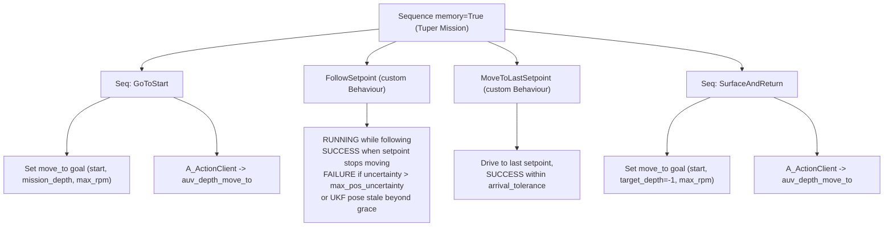

# lolo_tuper

LoLo's **TUPER** behaviour: an action server whose execution *is* a behaviour
tree. LoLo dives to a mission depth, follows an acoustically-estimated setpoint
that tracks a pair of leader vehicles, and surfaces/returns home once the
leaders stop.

It follows the same "action-server-as-a-BT" pattern as
[`alars_bt`](../../alars/alars/alars_bt.py): a single
[`GentlerActionServer`](../../smarc/smarc_action_base/smarc_action_base/gentler_action_server.py)
(a `smarc_msgs/action/BaseAction` server taking a JSON goal) whose loop ticks a
[`py_trees`](https://py-trees.readthedocs.io/) `BehaviourTree` at a fixed rate.
**No other action-server base class is used.**

---

## Mission



1. **GoToStart** - delegate to the external `auv_depth_move_to`
   ([`lolo_depth_move_to`](../lolo_depth_move_to)) action to reach the start
   position at `mission_depth`. Returns immediately if already within tolerance.
   Uses `max_rpm` so LoLo transits briskly to catch up with the leaders.
2. **FollowSetpoint** - a UKF-consistent **COURSE** control loop: LoLo steers
   toward the live UKF setpoint while holding `mission_depth` and a min-altitude
   floor, modulating RPM with a PID/bang-bang law. While no fresh UKF setpoint
   is available it bootstraps toward the goal's `initial_setpoint`.
   - Fails the whole task if the position uncertainty exceeds
     `max_pos_uncertainty`.
   - Succeeds when the setpoint has stopped moving (leaders done).
3. **MoveToLastSetpoint** - settle on the last known setpoint within
   `arrival_tolerance` (still UKF-based, since onboard nav is unreliable
   underwater).
4. **SurfaceAndReturn** - delegate to `auv_depth_move_to` with
   `target_depth = -1` to surface and return to the start position.

If any phase fails, the action aborts (`success = False`). On success, abort, or
cancel, the internal vehicle goal is reset so LoLo stops receiving course
commands from this node.

---

## Why a COURSE goal (and no TF)

Steering is computed entirely in absolute UTM from the estimator's own outputs:

```
bearing_enu = atan2(north_setpoint - north_pose, east_setpoint - east_pose)
```

This bearing is handed to the `Lolo` vehicle object as a **COURSE** goal
(`yaw_enu`), so heading, distance-to-setpoint, uncertainty gating and
stop-detection all live in one consistent UKF/UTM world with no TF lookups. The
depth + min-altitude floor is delegated to `Lolo.control_depth()`, which already
implements `min(goal.depth, (depth + altitude) - goal.min_altitude)` - the same
logic as the cruise-depth-at-heading server.

---

## Inputs (from the external estimator)

Produced by a **separate** estimator package (e.g. `acoustic_ekf_pkg`); this
node only subscribes. `/follower/ukf/pose` is the single source of truth.

| Topic (default)            | Type                                        | Used for |
|----------------------------|---------------------------------------------|----------|
| `/follower/ukf/pose`       | `geometry_msgs/PoseWithCovarianceStamped`   | Position (absolute UTM, frame `utm`), heading (ENU yaw in orientation `z,w`), and position uncertainty (2x2 covariance block). |
| `/follower/ukf/setpoint`   | `geographic_msgs/GeoPoint`                  | Desired follower position (lat/lon). Has **no header**, so it is timestamped on arrival. |

`navsatfix` is intentionally **ignored** (it is the same follower position as the
pose, but without covariance).

**Uncertainty metric:** the 1-sigma semi-major axis,
`sqrt(largest eigenvalue([[cov0, cov1], [cov6, cov7]]))`.

**Stop detection:** the setpoint is "stopped" when fresh, continuously-received
samples spanning the full `setpoint_stop_period` all lie within
`setpoint_stop_tolerance` of their centroid. Requiring *fresh* samples prevents a
comms dropout from masquerading as "leaders done".

---

## Outputs

Drives a `virtual_lolo` `Lolo` object during the follow phase, which publishes
the usual LoLo setpoints (RPM / yaw / roll / depth) on `lolo_msgs` topics. The
GoToStart and SurfaceAndReturn legs are actuated by the external
`auv_depth_move_to` server, not by this node directly.

Also publishes a human-readable status string on `lolo_tuper/status`
(`std_msgs/String`).

---

## Goal (per-mission JSON)

The action is `smarc_msgs/action/BaseAction`; the goal payload is a JSON string
in `goal.data`. Required fields are presence-checked on receipt; the few tunable
fields have defaults.

| Field                      | Required | Default | Units / meaning |
|----------------------------|:--------:|:-------:|-----------------|
| `start_position`           | yes      | -       | `{latitude, longitude}` - start AND return point. |
| `initial_setpoint`         | yes      | -       | `{latitude, longitude}` - bootstrap target until a live UKF setpoint arrives. |
| `mission_depth`            | yes      | -       | m, positive down; held through the dive. |
| `min_altitude`             | yes      | -       | m; seabed safety floor (>= vehicle min, default 1 m). |
| `setpoint_stop_tolerance`  | yes      | -       | m; radius the setpoint must stay within to count as stopped. |
| `setpoint_stop_period`     | yes      | -       | s; duration of fresh in-radius samples to declare a stop. |
| `arrival_tolerance`        | yes      | -       | m; radius to consider the last setpoint reached. |
| `start_tolerance`          | yes      | -       | m; tolerance for the move_to legs. |
| `timeout`                  | yes      | -       | s; per move_to leg timeout. |
| `min_rpm`                  | no       | 400     | Moving RPM floor while actively tracking a target. |
| `max_rpm`                  | no       | 700     | RPM saturation when far from the setpoint; also used for the transit (move_to) legs. |
| `max_pos_uncertainty`      | no       | 4.0     | m; fail the task if the semi-major-axis uncertainty exceeds this. |

### Example

```json
{
  "start_position":   {"latitude": 58.8403858, "longitude": 17.6516642},
  "initial_setpoint": {"latitude": 58.8409250, "longitude": 17.6527070},
  "mission_depth": 10.0,
  "min_altitude": 5.0,
  "min_rpm": 400.0,
  "max_rpm": 700.0,
  "max_pos_uncertainty": 4.0,
  "setpoint_stop_tolerance": 5.0,
  "setpoint_stop_period": 30.0,
  "arrival_tolerance": 5.0,
  "start_tolerance": 5.0,
  "timeout": 600.0
}
```

Send it (note the JSON is a string inside `goal.data`):

```bash
ros2 action send_goal /lolo/lolo_tuper smarc_msgs/action/BaseAction \
  "{goal: {data: '{\"start_position\":{\"latitude\":58.8403858,\"longitude\":17.6516642},\"initial_setpoint\":{\"latitude\":58.8409250,\"longitude\":17.6527070},\"mission_depth\":10.0,\"min_altitude\":5.0,\"setpoint_stop_tolerance\":5.0,\"setpoint_stop_period\":30.0,\"arrival_tolerance\":5.0,\"start_tolerance\":5.0,\"timeout\":600.0}'}}" \
  --feedback
```

---

## Node parameters (tuning constants)

Set in [`config/lolo_tuper_params.yaml`](config/lolo_tuper_params.yaml). These are
*node-level* knobs (not per-mission).

| Parameter                 | Default              | Meaning |
|---------------------------|----------------------|---------|
| `robot_name`              | `lolo`               | Passed to the `Lolo` vehicle object. |
| `limits_filename`         | `""`                 | Vehicle limits YAML; empty -> `virtual_lolo` default. |
| `control_frequency`       | `10.0`               | BT / control loop rate (Hz); also the `GentlerActionServer` loop frequency. |
| `estimate_max_age`        | `5.0`                | s; UKF pose/setpoint older than this is "stale". |
| `stale_grace_period`      | `10.0`               | s; how long a stale pose is tolerated (holding) before failing. |
| `pose_topic`              | `/follower/ukf/pose` | Estimator pose topic. |
| `setpoint_topic`          | `/follower/ukf/setpoint` | Estimator setpoint topic. |
| `move_to_action_name`     | `auv_depth_move_to`  | External depth-move-to action name. |
| `kp_rpm` / `ki_rpm` / `kd_rpm` | `50 / 0 / 5`    | RPM PID gains (error = forward/ahead setpoint error, m). |
| `integral_limit`          | `200.0`              | Clamp on the Ki contribution (RPM). |
| `hold_rpm`                | `400.0`              | Safe RPM while waiting, stale, inside the deadband, or not chasing a live setpoint that is side/behind LoLo. Clamped not below the mission `min_rpm`. |
| `heading_gate_deg`        | `60.0`               | If `|heading error|` exceeds this during final static approach, use `min_rpm` to turn. Live following holds only when the setpoint is not ahead. |
| `uncertainty_deadband_k`  | `2.0`                | Deadband radius = `max(arrival_tolerance, k * sigma)`; hold safe RPM inside it. |

### RPM control law

```
deadband = max(arrival_tolerance, uncertainty_deadband_k * sigma)
forward_error = projection of setpoint error onto LoLo's current heading
if dist <= deadband:
    rpm = max(min_rpm, hold_rpm)        # settle / don't chase estimator noise
elif following_live_setpoint and forward_error <= deadband:
    rpm = max(min_rpm, hold_rpm)        # keep depth authority, don't chase-turn
elif |heading_err| > heading_gate_deg:
    rpm = min_rpm                       # final static approach: keep flow to turn
else:
    rpm = min_rpm + Kp*forward_error + Ki*∫forward_error + Kd*max(d(forward_error)/dt, 0)
rpm = clip(rpm, min_rpm, max_rpm)
```

The deadband widens with position uncertainty, so a noisy estimate produces calm
behaviour rather than wiggling.

---

## Build & run

```bash
cd ~/colcon_ws
colcon build --packages-select lolo_tuper
source install/setup.bash
```

This node requires two things to be running:

1. the external `auv_depth_move_to` server (`lolo_depth_move_to`), and
2. the UKF estimator publishing the pose/setpoint topics.

`setup()` waits for the `auv_depth_move_to` server and aborts startup if it is
not found (you will see "Server not found ... shutting down").

Run via launch (puts the node in the robot namespace and loads the config):

```bash
ros2 launch lolo_tuper lolo_tuper.launch robot_name:=lolo
```

or directly:

```bash
ros2 run lolo_tuper lolo_tuper --ros-args --params-file \
  $(ros2 pkg prefix lolo_tuper)/share/lolo_tuper/config/lolo_tuper_params.yaml
```

---

## Testing in sim (the `tuper_test` faker)

`tuper_test` lets you dry-run the whole mission in simulation **without** the
real acoustic UKF. It fakes the two estimator inputs the BT consumes:

- After a configurable `warmup_seconds` (default 30 s) it starts publishing
  `/follower/ukf/pose` from the vehicle's TRUE position (`/lolo/smarc/latlon`
  converted to absolute UTM) plus an integrated random-walk noise, with heading
  taken from `/lolo/smarc/odom`. Because it tracks the real (simulated) vehicle,
  the control loop actually closes.
- Simultaneously it moves `/follower/ukf/setpoint` smoothly along a trajectory
  defined by vertices, at 0.5-0.8 m/s, slowing around corners, with occasional
  sideways jumps and along-track "runaway / snap-back" glitches that mimic UKF
  jumpiness. When the trajectory ends it holds the last vertex, so the BT's
  stop-detector fires and the mission proceeds to surface-and-return.

Everything is configured in
[`config/tuper_test_params.yaml`](config/tuper_test_params.yaml) - including the
noise model and the trajectory vertices, which can be given as `relative`
(east/north metres from the start, no GPS coords needed) or absolute `latlon`.

Run it (sim):

```bash
ros2 run lolo_tuper tuper_test --ros-args \
  --params-file $(ros2 pkg prefix lolo_tuper)/share/lolo_tuper/config/tuper_test_params.yaml \
  -p latlon_topic:=/<robot>/smarc/latlon -p odom_topic:=/<robot>/smarc/odom
```

`lolo_bringup.sh` already opens a `tuper` window that launches the BT server and,
in simulation, this faker alongside it. Trigger the mission as usual (GUI / MQTT
/ `ros2 action send_goal`) once the faker is publishing.

> Tip: set `reported_sigma` above the mission's `max_pos_uncertainty` (default
> 4 m) to exercise the uncertainty-failure path.

## Layout

```
lolo_tuper/
├── config/
│   ├── lolo_tuper_params.yaml   # node tuning constants
│   └── tuper_test_params.yaml   # faker config (noise + trajectory vertices)
├── launch/lolo_tuper.launch
└── lolo_tuper/
    ├── follower_state.py        # subscriber/holder of UKF estimates (no estimation here)
    ├── tuper_behaviours.py      # FollowSetpoint, MoveToLastSetpoint, TuperGoal, ControlGains
    ├── tuper_test_node.py       # sim faker for /follower/ukf/pose + /follower/ukf/setpoint
    └── lolo_tuper_bt.py         # goal handling, BT assembly, GentlerActionServer, main
```

## Dependencies

`rclpy`, `smarc_action_base`, `smarc_msgs`, `virtual_lolo`, `geographic_msgs`,
`sensor_msgs`, `geometry_msgs`, `std_msgs`, `geodesy`, `numpy`, plus the BT stack
(`py_trees`, `wasp_bt`) used by `smarc_action_base`'s BT action client.

## Notes / current defaults

- "Move to last setpoint" uses the UKF course-control loop (not a `move_to`
  leg), because onboard nav is unreliable underwater.
- On an uncertainty failure the action simply aborts; there is no automatic
  emergency-surface here (left to the higher-level mission /
  `lolo_emergency_action`).
- Pose UTM and setpoint UTM are assumed to share one UTM zone (true for a single
  operating area).
